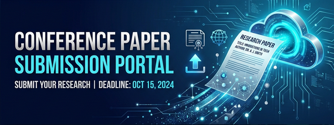

<h1 align="center"> Conference Paper Submission Portal</h1>

  
  
  
  

A robust, enterprise-grade portal for managing conference paper submissions, built on Oracle 19c and Oracle APEX.

---

## 🚀 Overview

The Conference Paper Submission Portal is designed to streamline the academic submission process. It facilitates the interaction between students, faculty, reviewers, and administrators, providing a centralized platform for managing research papers.

---

## 🌐 Live Demo

You can explore the live application here:
[Conference Paper Submission Portal](https://oracleapex.com/ords/r/ajaygangwar945/conference-paper-submission-portal/home)

> [!NOTE]
> The session ID in the URL is temporary. For best results, use the base link provided above.

---

## 🛠 Tech Stack

- **Database**: Oracle 19c
- **Application Framework**: Oracle APEX
- **Languages**: SQL, PL/SQL
- **Frontend**: APEX Universal Theme

---

## ✨ Key Features

- **User Management**: Multi-role system (Student, Faculty, Admin, Reviewer) with secure credential handling.
- **Conference Tracking**: Manage multiple conferences with specific submission deadlines and location details.
- **Paper Submission**: Seamless paper upload with automated validations (e.g., submission limits per user).
- **Review System**: Specialized roles for reviewing and scoring papers with final decision tracking.
- **Real-time Lifecycle**: Track paper status from "Submitted" to "Accepted" or "Rejected".

---

## 📂 Project Structure

- `Conference-Paper-Submission-Portal.sql`: Core database schema including table definitions, constraints, triggers, and stored procedures.
- `Project_Documentation.txt`: Detailed technical documentation and architectural overview.
- `Conference-Paper-Submission-Portal-Banner.png`: Project banner image.
- `logo.svg`: Project logo.
- `README.md`: Project documentation and setup guide.

---

## ⚙️ Setup Instructions

1. **Database Setup**:
   - Run `Conference-Paper-Submission-Portal.sql` in your Oracle SQL workshop or via SQL*Plus.
   - This will initialize all tables, sequences (identities), triggers, and reference data.
2. **APEX Integration**:
   - Use the Oracle APEX App Builder to create an application based on the existing schema.
3. **Roles Application**:
   - Assign user roles within the APEX application to match the `users` table roles.

---

## ⭐ Support the Project

If you find this project useful, please consider giving it a **Star**! Your support helps make the project better.
